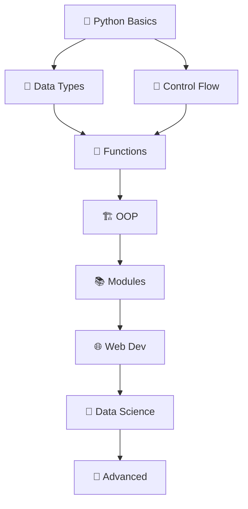

# Hi there 👋 I'm Pratham Dada

## About Me
Welcome to my GitHub! I'm a passionate developer with a keen interest in building innovative solutions and contributing to open-source projects. I love learning new technologies and collaborating with fellow developers to create impactful software.

---

## 🚀 Skills & Technologies

### Languages


### Tools & Platforms


---

## 📊 GitHub Statistics

[](https://github.com/anuraghazra/github-readme-stats)

[](https://github.com/anuraghazra/github-readme-stats)

---

## 🏆 Featured Projects

### Project One
A brief description of your first notable project and what makes it special.
- **Technologies:** List the tech stack
- **Repository:** [Link to repo](#)

### Project Two
A brief description of your second notable project.
- **Technologies:** List the tech stack
- **Repository:** [Link to repo](#)

---

## 🌱 Currently Learning
- New frameworks and technologies
- Best practices in software development
- Contributing to open-source communities

---

## 💼 Professional Links
- 🔗 [Portfolio](#)
- 💼 [LinkedIn](#)
- 🐦 [Twitter](#)
- 📧 [Email](mailto:your.email@example.com)

---

## 📫 Let's Connect!
Feel free to reach out if you'd like to collaborate, discuss tech, or just say hello!

---

Last updated: 2026-04-26
<div align="center">
<svg width="500" height="120" viewBox="0 0 500 120" xmlns="http://www.w3.org/2000/svg">
  <defs>
    <linearGradient id="grad1" x1="0%" y1="0%" x2="100%" y2="100%">
      <stop offset="0%" style="stop-color:#FF6B6B;stop-opacity:1" />
      <stop offset="50%" style="stop-color:#4ECDC4;stop-opacity:1" />
      <stop offset="100%" style="stop-color:#45B7D1;stop-opacity:1" />
    </linearGradient>
    <filter id="shadow">
      <feDropShadow dx="2" dy="2" stdDeviation="3" flood-color="#000" flood-opacity="0.3"/>
    </filter>
  </defs>
  
  <!-- Shadow -->
  <text filter="url(#shadow)" x="250" y="80" font-family="Arial Black, sans-serif" font-size="60" font-weight="900" 
        fill="#333" text-anchor="middle" transform="rotate(-1 250 80)">Pratham</text>
  <text filter="url(#shadow)" x="250" y="105" font-family="Arial Black, sans-serif" font-size="60" font-weight="900" 
        fill="#333" text-anchor="middle" transform="rotate(1 250 105)">Dada</text>
  


Enthusiastic CS Student | Code Runner 🏃‍♂️💻

[](https://github.com/prathamdadaa)
[](https://github.com/prathamdadaa)

</div>

## 🚀 About Me


 Pratham Dada | Student |  Dhanbad, Jharkhand   | Code. Learn. Build.
# Pratham's Tech Journey

[](https://github.com/prathamdadaa)
[](https://github.com/prathamdadaa)
[](https://github.com/prathamdadaa/tech-journey/blob/main/LICENSE)

> "A student passionately exploring the world of programming languages and cutting-edge technologies."

## 👋 About Me

Enthusiastic Computer Science student on a mission to master diverse programming languages and modern technologies.  
Currently exploring: Python, JavaScript, Java, C++, React, Node.js, Docker, AWS, and more!

## 🚀 Featured Projects


🛠️ Tech Stack
Languages
Python
JavaScript
Java
C++

Frameworks & Libraries
React
Node.js
Spring Boot

Tools & DevOps
Docker
Git
VS Code

Cloud & Databases
AWS
MongoDB
PostgreSQL

📈 GitHub Stats
Pratham's GitHub Stats

🎯 Current Learning Goals
[ ] Master TypeScript and Next.js
[ ] Complete AWS Certified Developer certification
[ ] Build a full-stack e-commerce platform
[ ] Learn Kubernetes and CI/CD pipelines
[ ] Contribute to open source projects
🤝 Let's Connect
<p align="center"> <a href="https://linkedin.com/in/prathamdadaa">  </a> <a href="www.linkedin.com/in/pratham-dada-405029403">  </a> <a href="https://www.instagram.com/prathamdadaa?">  </a> </p>

🛠️ Tech Stack
Languages
Python
JavaScript
Java
C++

Frameworks & Libraries
React
Node.js
Spring Boot

Tools & DevOps
Docker
Git
VS Code

Cloud & Databases
AWS
MongoDB
PostgreSQL

- 🎓   Computer Science Student  
- 💻   Full-Stack Developer  
- 🔭   Currently learning  : TypeScript, Docker, AWS
- 🌱   Exploring  : React, Node.js, Python, Java
- 📫   Reach me  : pratham.dada@example.com

</div>

## 🛠️ Tech Stack

<div align="center">

### 🌐 Frontend


### 🖥️ Backend


### 🗄️ Database


### ⚙️ Tools


</div>

## 📊 GitHub Stats

<div align="center">


  🐍 Snake Animation  


</div>

## 🔥 Featured Projects

<div align="center">

------------------------------------ new one by Pdada

## 🐍   Python Knowledge Hub   for GitHub README

###   Complete Copy-Paste Section with Images  

```markdown
<div align="center">

# 🐍 Python Knowledge Thinker


  Master Python Concepts Visually!   📚✨

</div>

## 🎯   Python Learning Roadmap  



## 📊   Core Python Concepts (Visual Guide)  

<div align="center">

###   1. Data Types Hierarchy  


```
Numbers: int, float, complex
Sequences: str, list, tuple, range
Mapping: dict
Sets: set, frozenset
Others: bool, bytes, bytearray, memoryview
```

###   2. List vs Tuple vs Dict  
<table>
<tr>
  <th>📋 List</th>
  <th>📦 Tuple</th>
  <th>🔑 Dict</th>
</tr>
<tr>
  <td><code>[1, 2, 3]</code><br>Mutable ✅</td>
  <td><code>(1, 2, 3)</code><br>Immutable ✅</td>
  <td><code>{'a': 1}</code><br>Key-Value ✅</td>
</tr>
</table>

</div>

## ⚡   Python One-Liners Cheatsheet  

```python
# 🧠 50+ Essential One-Liners

# List Comprehensions
squares = [x  2 for x in range(10)]                    # [0, 1, 4, ..., 81]
evens = [x for x in range(20) if x % 2 == 0]           # Even numbers

# Dictionary Comprehensions
sq_dict = {x: x  2 for x in range(5)}                  # {0:0, 1:1, 2:4, ...}
unique_chars = {c: i for i, c in enumerate("python")}   # Char positions

# Lambda Functions
add = lambda x, y: x + y                                # Anonymous function
sorted_list = sorted([3, 1, 4], key=lambda x: -x)       # Descending sort

# Powerful Built-ins
files = list(filter(lambda x: x.endswith('.py'), os.listdir()))  # Filter files
total = sum(map(lambda x: x  2, range(10)))                    # Sum squares

# String Magic
"hello".join(["world", "!"])           # "world!hello"
" ".join("python".split(""))           # "p y t h o n"
```

## 🔬   Python Magic Methods Visualized  

<div align="center">

</div>

```python
class MagicBox:
    def __init__(self, value): self.value = value
    
    def __str__(self): return f"Box({self.value})"           # str(obj)
    def __repr__(self): return f"MagicBox({self.value})"     # repr(obj)
    def __len__(self): return len(str(self.value))           # len(obj)
    def __getitem__(self, key): return self.value[key]       # obj[key]
    def __call__(self): return self.value   2                # obj()
```

## 📈   Time & Space Complexity Cheat Sheet  


    O1[O(1) Constant<br/>🔥 Array Access]
    On[O(n) Linear<br/>📏 Search]
    Onlogn[O(n log n)<br/>⚡ Merge Sort]
    On2[O(n²) Quadratic<br/>⚠️ Bubble Sort]
    
    O1 -->|Best| On
    On -->|Good| Onlogn
    Onlogn -->|Acceptable| On2
```

| Operation | Time | Space |
|-----------|------|-------|
| List Append | O(1) | O(1) |
| List Access | O(1) | O(1) |
| Dict Lookup | O(1) | O(n) |
| Binary Search | O(log n) | O(1) |

## 🛠️   Essential Python Libraries  

<div align="center">

| Category | Library | Use Case | 
|----------|---------|----------|
| 🌐   Web   | `requests`, `flask`, `fastapi` | APIs, Web Apps |
| 🔬   Data   | `pandas`, `numpy`, `matplotlib` | Data Analysis |
| 🤖   ML   | `tensorflow`, `scikit-learn`, `pytorch` | Machine Learning |
| 📊   Async   | `asyncio`, `aiohttp` | Concurrent Programming |
| 🧪   Testing   | `pytest`, `unittest` | Test Automation |

```python
# 🔥 One-liner imports
from collections import Counter, defaultdict, deque
from functools import lru_cache, reduce
from itertools import chain, combinations, permutations
```
</div>

## 🎨   Decorators Visual Guide  

```python
# 🪄 Decorator Anatomy
def timer(func):
    def wrapper( args,   kwargs):
        start = time.time()
        result = func( args,   kwargs)
        print(f"{func.__name__}: {time.time()-start:.2f}s")
        return result
    return wrapper

@timer  # Sugar syntax
def slow_function():
    time.sleep(1)
    return "Done!"

# Usage: slow_function()  # Prints timing automatically!
```

<div align="center">

</div>

## 🚀   Pro Tips & Patterns  

```python
# 1. Walrus Operator (3.8+)
if (n := len(data)) > 1000: print(f"Too big: {n}")

# 2. Multiple Assignment
a, b,  rest = [1, 2, 3, 4, 5]  # a=1, b=2, rest=[3,4,5]

# 3. Context Managers
with open('file.txt') as f, tempfile.NamedTemporaryFile() as tmp:
    data = f.read()

# 4. Generator Expressions (Memory Efficient)
total = sum(x  2 for x in large_dataset)  # No list created!

# 5. Type Hints (Modern Python)
def greet(name: str, age: int = 18) -> str:
    return f"Hello {name} ({age})"
```

## 📱 Quick Reference Cards

<div align="center">

```
🐍 PYTHON CHEAT SHEET
┌─────────────────────────────────────┐
│ List: [1,2,3]    Dict: {'a':1}     │
│ Tuple:(1,2,3)    Set: {1,2,3}      │
│ Slice: lst[1:3]  Reverse: lst[::-1] │
│ Zip: zip(a,b)    Enum: enumerate() │
│ Map/Filter/Reduce                   │
└─────────────────────────────────────┘
```

</div>

---

<div align="center">

<br>
⭐ Star if this helps your Python journey! 🐍✨
<br><br>
Created by Pratham Dada
</div>
```


```


📬 Contact Me
Email: prathamdadaa@gmail.com
Portfolio: pratham-dada.dev
Location: India 🌍

Made with ❤️ by Pratham Dada
